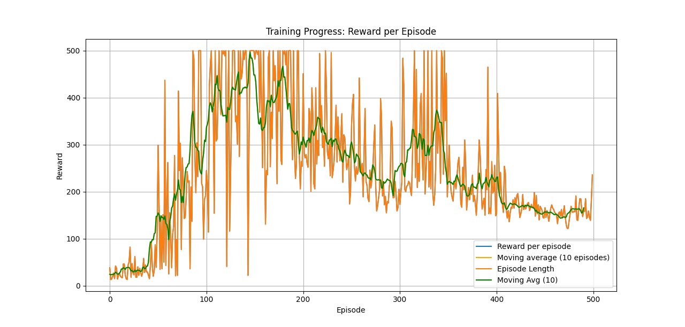
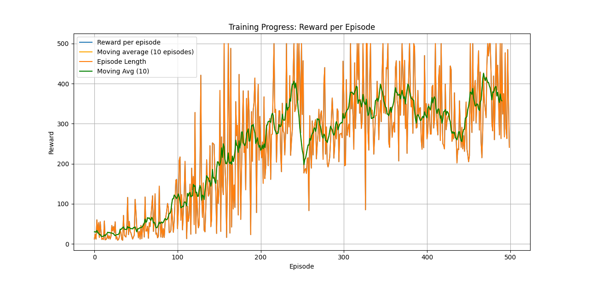
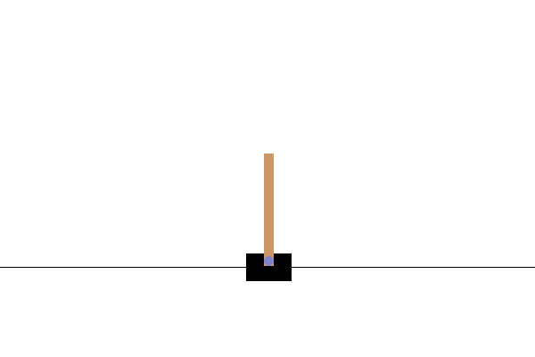
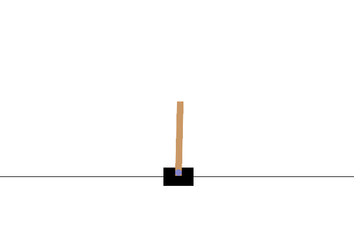
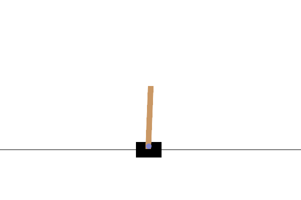

# Deep Q-Learning CartPole

This folder contains a TensorFlow/Keras Deep Q-Learning experiment for `CartPole-v1`.
The current focus of the experiment is not only maximizing reward, but also diagnosing
why the learned policy can plateau, slump, or drift toward one side of the track.

## Training Setup

The main training entry point is `main_test.py`. It trains a DQN agent with:

- an online Q-network and target network,
- replay-buffer sampling,
- epsilon-greedy exploration,
- periodic target-network synchronization,
- periodic GIF recording every 25 episodes,
- optional pretrained weight loading,
- optional reward shaping.

Pretrained weights are disabled by default so training starts from a fresh network:

```python
load_weights_path = None
# load_weights_path = "C:/Users/a.pasagic/Python Projects/Reinforcement-learning/reinforcement-learning/models/qnetwork_weights.weights.h5"
```

## Epsilon Experiments

Two epsilon schedules were compared while investigating unstable training and reward plateaus.

### Higher final epsilon

```python
epsilon_start = 1.0
epsilon_end = 0.05
decay_rate = 0.99
```



With this schedule, rewards typically increase at first, but the policy can still slump after
apparently learning useful behavior. The higher exploration floor keeps action noise present
late in training, which can help avoid overfitting to a brittle policy, but it can also keep
the evaluation behavior visibly noisy.

### Lower final epsilon with slower decay

```python
epsilon_start = 1.0
epsilon_end = 0.01
decay_rate = 0.995
```



This schedule produced better sustained learning in later episodes. The reward still shows
large variance and occasional drops, but the moving average remains higher after learning
begins. This suggests that exploration scheduling was one contributor to the earlier plateau,
but not the only issue.

## Observed Drift

Periodic GIF recording was added to make the learned behavior easier to inspect visually.
Later high-reward episodes showed a recurring issue: the agent can keep the pole balanced
while steadily drifting toward the left or right edge of the track.



This can happen because the default CartPole reward is sparse with respect to cart position:
the environment gives `+1` for each timestep the episode remains alive. A policy can therefore
receive high reward even if it balances the pole while drifting away from the center.

## Reward Shaping

To address the drift, `reward_shaping.py` adds a small Gymnasium wrapper:

```python
env = gym.make("CartPole-v1", render_mode="rgb_array")

if use_reward_shaping:
    env = CartPoleRewardShaping(
        env,
        center_weight=reward_shaping_center_weight,
        angle_weight=reward_shaping_angle_weight
    )

env = gym.wrappers.RecordEpisodeStatistics(env)
```

The wrapper intercepts `env.step(action)`, reads the returned CartPole state, and subtracts
small penalties for:

- cart position away from center,
- pole angle away from upright.

The shaped reward is:

```python
shaped_reward = reward - center_penalty - angle_penalty
```

The initial weights are intentionally conservative:

```python
use_reward_shaping = True
reward_shaping_center_weight = 0.03
reward_shaping_angle_weight = 0.015
reward_shaping_ramp_start_episode = 300
reward_shaping_ramp_end_episode = 1200
```

The shaping is scheduled as a curriculum. Early episodes use the original CartPole reward,
which lets the agent first learn the basic survival behavior. The center and angle penalties
then ramp in gradually, so the policy is nudged toward a more centered and upright behavior
after it has already learned to keep the pole balanced.

The wrapper records `raw_reward`, `center_penalty`, `angle_penalty`, `shaped_reward`,
`reward_shaping_scale`, and the active shaping weights in `info` so future experiments can
compare raw and shaped reward separately.

## Reward Shaping Results

After adding the scheduled center and angle penalties, later episodes show noticeably better
position maintenance. The policy still uses small, frequent corrections, but it no longer
leans as strongly into a one-direction drift in these examples.





The control is still jittery. That could be improved with additional reward shaping, for
example by softly penalizing large cart velocity, pole angular velocity, or rapid action
switching. Those terms should be introduced carefully because too much smoothness pressure can
make the agent slower to recover when the pole genuinely needs a sharp correction.

## Notes For Further Experiments

- Plot raw reward and shaped reward separately to make sure shaping improves behavior rather
  than only changing the score scale.
- Compare GIFs with `use_reward_shaping = False` and `True`.
- Tune `center_weight` first if lateral drift remains visible.
- Tune `angle_weight` carefully; too much angle penalty can make the agent optimize posture
  over long-term survival.
- Consider small smoothness penalties if jitter remains visible after position drift is under
  control.
- Consider an episode-level learning-rate scheduler later. In Keras, a manual scheduler based
  on moving-average episode reward may fit this replay-loop setup better than a batch-level
  `ReduceLROnPlateau` callback.
